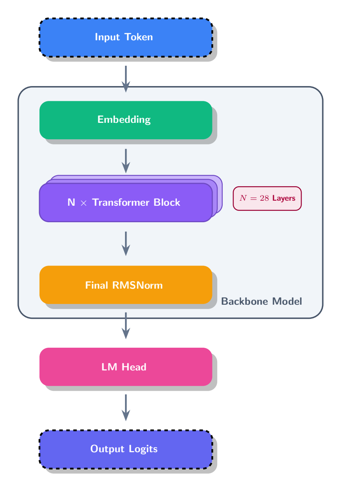

# qwen3-miniLab

用 Jupyter notebook 逐步解剖 Qwen3-0.6B-Base：每一步计算都自己重写一遍，再和官方实现逐个张量比对。

不是讲义，是实验记录。每个结论都由当场跑出来的数字支撑，不能验证的话不写。

## 两个实验

| notebook | 回答的问题 |
|---|---|
| [实验 1：外部骨架](notebooks/01_inspect_architecture.ipynb) | 一个 token 进入模型后，要依次经过哪些主要模块？ |
| [实验 2：完整前向传播](notebooks/02_dissect_forward_pass.ipynb) | 这些计算究竟是什么，能否被自己重新实现并验证？ |

<div align="center">
  
</div>

实验 2 从 `RMSNorm`、`Linear`、`SiLU` 三块积木起步，一路手写 embedding、RoPE、causal
mask、GQA attention、SwiGLU，拼出完整的 28 层，最后跑通端到端：输入一句话，
自己的实现和官方模型给出同一个 argmax。

## 怎么算「验证过」

判据是**尺度相对误差 < 1e-5**：绝对误差除以两边张量的量级，避免大数值上的正常浮点抖动
被误判成实现错误。实验 2 累计 40 项验证，全部通过。

两个刻意的选择：

- **float32**，不用磁盘上的 bfloat16。bf16 只有 7 位尾数，一次 1024 维 matmul 的舍入误差
  就有 3.75e-03，比判据大两个半数量级 —— 那样根本分不出「写错了」和「bf16 就这样」。
- **eager attention**，不用默认的 sdpa。sdpa 把整个 attention 融进一个算子，
  attention weights 和 causal mask 都拿不到，而那正是要观察的东西。

## 跑起来

```bash
python -m venv .venv && . .venv/bin/activate    # 实测 Python 3.14.6
pip install -r requirements.txt
```

两本 notebook 全程在 CPU 上跑 float32，用不到 GPU。而 linux 上 `pip install torch` 默认拉
CUDA 版，附带的 nvidia wheel 装完占 2.66 GiB。不需要 GPU 的话先装 CPU 版，能省下这些：

```bash
pip install torch==2.13.0 --index-url https://download.pytorch.org/whl/cpu
pip install -r requirements.txt          # torch 已满足，不会被顶掉
```

实测这条路径装出来的环境 1.3 GB（默认 CUDA 版 5.1 GB），整本跑完 40 项验证同样全过。

## 下权重

权重不入库，自己下到 `models/Qwen3-0.6B-Base/`，约 1.2 GB。`hf` 命令随
`huggingface_hub` 一起装好了：

```bash
hf download Qwen/Qwen3-0.6B-Base --local-dir models/Qwen3-0.6B-Base
```

从 `notebooks/01_inspect_architecture.ipynb` 开始，按顺序执行。

## 目录

```
notebooks/qwen_kit.py    共用工具：权重与中间状态目录、look/check/summary、HTML 表格
notebooks/0*.ipynb       实验本体，按编号顺序读
assets/                  结构图（PNG 用于展示，tex/ 下是 TikZ 源码）
models/                  权重存放处，不入库
```

`qwen_kit` 的作用是把重复的脚手架收走 —— 用 hook 抓下官方每一层的中间状态，
建成 `qwen.L[i]` 和 `W.L[i]` 两份可以直接点出来的目录，notebook 里只留下真正的计算和比对。

## 一起改

notebook 的 `.ipynb` 是 JSON，输出占了这本文件的三分之二。两个人各跑一遍同一本，
`execution_count` 和浮点尾数全变，`git diff` 就是几十行假改动，冲突也没法手工解。

`nbdime` 让 git 按 cell 比较而不是按 JSON 行。两边都装一次：

```bash
pip install -r requirements-dev.txt
nbdime config-git --enable                     # 写进 .git/config，clone 后要各自跑
git config diff.jupyternotebook.command 'git-nbdiffdriver diff --ignore-details'
```

最后那行让纯重跑（只有 `execution_count` 变化）在 `git diff` 里显示为无改动，
真改了 cell 源码才会列出来，精确到哪个 cell 的哪一行。

工具只能压掉噪音，压不掉冲突本身。**同一本 notebook 不要两个人同时改** ——
一人一本，或者动手前说一声。
